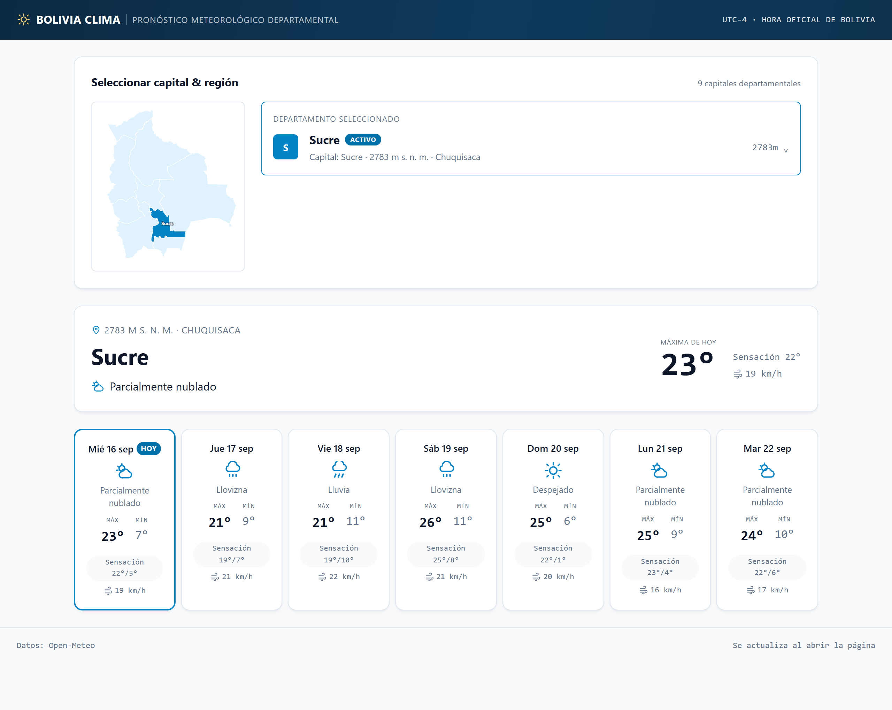
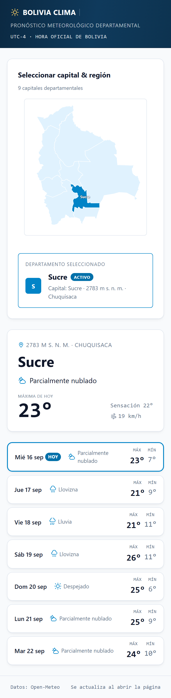

# Clima Bolivia — Pronóstico de 7 días

Aplicación web que muestra el pronóstico de los próximos siete días para las
nueve capitales departamentales de Bolivia.

**Aplicación desplegada:** <https://clima-bolivia-theta.vercel.app/>
**Repositorio:** <https://github.com/MarlonTMF/Clima_Bolivia>



<details>
<summary>Vista móvil (390 px)</summary>



</details>

---

## Cómo ejecutar el proyecto

**Requisitos:** Node.js 20 o superior (desarrollado con la 24.14.0) y npm.
No hace falta ninguna clave de API ni archivo `.env`: la API elegida no pide
autenticación.

```bash
git clone https://github.com/MarlonTMF/Clima_Bolivia.git
cd Clima_Bolivia
npm install
npm run dev          # http://localhost:5173
```

### Todos los comandos

| Comando | Qué hace |
|---|---|
| `npm run dev` | Servidor de desarrollo |
| `npm run build` | Compila tipos y genera `dist/` para producción |
| `npm run preview` | Sirve el `dist/` ya compilado |
| `npm run test` | 19 pruebas con Vitest |
| `npm run typecheck` | Comprobación de tipos |
| `npm run lint` | oxlint |
| `npm run audit` | Auditoría propia de fallos silenciosos (ver más abajo) |
| **`npm run check`** | **Los cinco anteriores en orden. Es el que se ejecuta antes de cada commit** |

Una nota sobre `typecheck`: usa `tsc -b --noEmit`, no `tsc --noEmit`. El
`tsconfig.json` raíz es un archivo de referencias sin archivos propios, así
que `tsc --noEmit` **devuelve éxito aunque haya errores de tipos**. Se
descubrió introduciendo un error a propósito para comprobar que el hook de
verificación servía de algo, y no servía.

---

## Tecnologías

| Pieza | Elección | Por qué |
|---|---|---|
| Framework | React 19 | Componentización y tipado, y es lo más reconocible para quien evalúa. Svelte habría sido más ligero; se eligió React por familiaridad, no por superioridad técnica |
| Lenguaje | TypeScript | Tipar la respuesta de la API convierte un error de mapeo en un fallo de compilación en vez de en una pantalla en blanco |
| Build | Vite | Un comando para arrancar y para compilar, sin configuración |
| Estilos | CSS plano | Sin framework: son unas 970 líneas que se pueden explicar una a una |
| Pruebas | Vitest + Testing Library | 19 pruebas: lógica, mapeo de la API, los cinco casos de error y los cuatro estados de la interfaz |
| Linter | oxlint | Viene con la plantilla de Vite |
| Despliegue | Vercel (plan gratuito) | Sitio estático servido desde CDN |

### Dependencias de producción: dos

```json
"dependencies": { "react": "^19.2.8", "react-dom": "^19.2.8" }
```

**Eso es todo.** Sin router, sin gestor de estado, sin cliente HTTP, sin
librería de CSS, sin librería de iconos, sin librería de fechas. Para una
sola pantalla, cada dependencia sería una decisión más que defender y una
superficie más que explicar:

- **Sin router**, porque no hay rutas: una vista con cuatro estados.
- **Sin gestor de estado**, porque el estado son cuatro `useState` en el
  componente raíz.
- **Sin cliente HTTP**: `fetch` nativo cubre el caso, incluido el timeout con
  `AbortController`.
- **Sin librería de iconos**: los iconos meteorológicos son SVG escritos a
  mano, unas pocas líneas cada uno. Empezaron siendo emoji y se retiraron
  porque se renderizan distinto en cada sistema operativo.
- **Sin librería de fechas**: el formato lo resuelve `Intl.DateTimeFormat`,
  que está en el navegador.

Las dependencias de **desarrollo** sí existen —Vitest, Testing Library,
jsdom, TypeScript— y no contradicen lo anterior: no entran en el paquete
final ni llegan al usuario.

El resultado compilado son **99 KB comprimidos**, de los que unos 68 KB son
React. Ese peso es la contrapartida asumida de la decisión.

---

## La API: Open-Meteo, y por qué

Se compararon cuatro opciones contra su documentación oficial **antes** de
elegir, no después.

| API | 7 días diarios en plan gratuito | Clave | Peticiones para 9 ciudades | Veredicto |
|---|---|---|---|---|
| **Open-Meteo** | Sí | **No requiere** | **1** | **Elegida** |
| OpenWeather | Vía *One Call*, modelo de pago por uso con 1 000 llamadas diarias gratis | Sí | 9 | Descartada |
| WeatherAPI.com | **No: sólo 3 días** | Sí | 9 | Descartada por no cumplir el requisito |
| Meteosource | Sí | Sí | 9 | Descartada: 9 llamadas por carga sobre un límite de 400 diarias |

Las tres razones de la elección:

1. **Cobertura del requisito.** WeatherAPI ofrece tres días en su plan
   gratuito y el desafío pide siete. Queda fuera por no cumplir, no por
   preferencia.
2. **Una petición en lugar de nueve.** Open-Meteo acepta varias coordenadas
   en la misma llamada. Es la decisión de rendimiento más grande del
   proyecto y sale gratis.
3. **Superficie operativa cero.** Sin clave, sin cuenta que mantener, sin
   secreto que rotar y sin backend necesario para ocultarlo.

**La limitación real, dicha por delante:** el uso gratuito de Open-Meteo es
**no comercial**, bajo licencia CC-BY 4.0. Si este proyecto pasara a uso
comercial habría que pagar su plan o reevaluar OpenWeather — que además
exigiría un backend propio para no exponer la clave en el navegador.

---

## Ventajas y limitaciones

### Ventajas

- **Carga completa en 1,5–1,9 s** hasta ver datos en pantalla, medido sobre
  el despliegue real: mediana de cinco cargas, 1 896 ms en Chromium y
  1 463 ms en Firefox. First Contentful Paint de 1,4–1,7 s.
- **Lighthouse 99-100 en rendimiento, 100 en accesibilidad, 100 en prácticas
  recomendadas y 100 en SEO**, medido en producción.
- **Cumulative Layout Shift de 0**: la página no da ningún salto al llegar
  los datos, porque el estado de carga reserva el espacio exacto que
  ocupará el contenido.
- **Funciona sin conexión a la API** si ya se había cargado antes: muestra la
  última lectura guardada avisando de su antigüedad.
- **Cambiar de proveedor de clima costaría tocar un archivo**, porque la
  respuesta cruda nunca sale de `weatherApi.ts`.
- **Añadir ciudades es una línea** en `src/data/cities.ts`.

### Limitaciones

- **No hay temperatura actual.** La API entrega pronóstico diario, no
  lecturas instantáneas. El número grande del panel es la **máxima de hoy** y
  está etiquetado como tal: inventar una «temperatura actual» a partir de un
  máximo diario habría sido presentar un dato que no se tiene.
- **Los datos se piden una sola vez, al abrir la página.** No hay refresco
  automático, y el pie lo dice literalmente. La copia local es un respaldo
  ante fallos, no una caché que evite peticiones.
- **Sólo nueve ciudades, fijas en el código.** No hay buscador ni geocoding:
  el enunciado pide exactamente esas nueve y son un dato estable.
- **Sin backend.** Se diseñó un proxy con caché y **se decidió no
  construirlo**; el razonamiento completo está más abajo.
- **No probado en un teléfono físico.** Se verificó a 375 px en navegadores
  de escritorio, que no reproduce el táctil ni la red móvil.
- **El orden de `cities.ts` está acoplado al de la petición.** Es
  deliberado y está documentado, pero es una trampa real para quien lo toque
  sin leer: hay una prueba que la vigila.

---

## Calidad y pruebas

`npm run test` ejecuta **19 pruebas** repartidas en cinco archivos:

| Nivel | Qué cubre |
|---|---|
| Lógica de dominio | Traducción de los 28 códigos WMO documentados y su valor neutro; formato de fecha sin desfase de zona horaria |
| Mapeo de la API | La respuesta real guardada en `docs/api-sample.json` → el modelo propio |
| Casos de error | Red caída, HTTP 500, timeout abortado, JSON con forma inesperada y camino correcto |
| Invariante de orden | Que la petición pida las coordenadas en el mismo orden que `CITIES` |
| Componentes | Tarjeta de día, cambio de ciudad, y los cuatro estados de la aplicación |

Además, **12 casos manuales ejecutados sobre el despliegue en producción**,
en Chromium y en Firefox, con el resultado real anotado en
[`docs/pruebas.md`](docs/pruebas.md) — incluidos los que hubo que
replantear porque no probaban lo que decían.

### La prueba del orden, que es la que más importa

La API devuelve un array en el orden de la petición. Si ese orden se
rompiera, **cada ciudad mostraría el clima de otra sin que nada fallara**:
sin error, sin excepción, sin pista. Es el único fallo verdaderamente
silencioso del proyecto.

Se añadió una prueba que compara los parámetros de la URL contra `CITIES`, y
se comprobó que sirve **invirtiendo el orden a propósito**. Al hacerlo, la
prueba falla — y las otras seis del mismo archivo siguen pasando en verde.
Esa es la demostración de por qué hacía falta.

### `npm run audit`, y por qué existe

Casi todos los errores reales de este proyecto fueron del mismo tipo: **código
válido que no produce ningún error y simplemente no hace nada**. Una regla CSS
apuntando a una clase inexistente. Un contorno de foco sobre un elemento con
`opacity: 0`, invisible aunque el CSS fuera correcto. Un `flex-direction` en
un contenedor que a ese ancho es `grid`. `tsc` y `oxlint` no los ven porque
comprueban sintaxis y tipos, no efecto.

`scripts/audit.mjs` comprueba esas seis categorías. **Cada una existe porque
ese error se cometió de verdad aquí**, y se verificó que la auditoría los
detecta reintroduciéndolos uno a uno en lugar de darla por buena por estar
escrita. La primera versión de una de las comprobaciones no detectaba nada y
hubo que reescribirla.

### Qué se decidió NO probar

- **Sin pruebas de extremo a extremo permanentes.** Playwright se usó como
  herramienta de verificación puntual, no como dependencia del proyecto: para
  una sola pantalla, mantener esa infraestructura cuesta más de lo que aporta.
- **Sin pruebas de instantánea:** se rompen con cada ajuste de estilo y no
  afirman nada sobre el comportamiento.
- **Sin objetivo de cobertura porcentual:** perseguir el número lleva a probar
  código trivial. Se declara qué está cubierto y qué no.
- **Sin pruebas de carga:** sitio estático con un techo fijo de 63 datos.
- **Sin probar React ni `fetch`:** son dependencias, no código propio.

---

## Decisiones técnicas principales

Las catorce decisiones están razonadas en
[`docs/decisiones.md`](docs/decisiones.md) con su contexto, las alternativas
consideradas y su consecuencia. Las principales:

**Una sola petición para las nueve ciudades.** Open-Meteo acepta varias
coordenadas a la vez. Nueve peticiones habrían significado nueve formas de
fallar parcialmente y nueve veces la latencia.

**El orden de las ciudades es significativo, y es deliberado.** La respuesta
llega como array en el orden de la petición, y las coordenadas devueltas
vienen ajustadas a la malla del modelo meteorológico, así que **no se pueden
reemparejar comparándolas**. El acoplamiento es la solución correcta aquí, no
un descuido: está documentado y hay una prueba que lo vigila.

**La respuesta cruda de la API nunca sale de `weatherApi.ts`.** Ningún
componente ve un `temperature_2m_max`. Es la decisión más barata de tomar y
la que más se ha pagado: cambiar de proveedor sería tocar un archivo.

**Ocho categorías de clima en lugar de treinta códigos.** Un usuario no
necesita distinguir «llovizna helada ligera» de «llovizna helada densa». Los
códigos desconocidos caen en un valor neutro para que la tarjeta no se rompa
si la API añade alguno.

**El diseño se generó con una herramienta de IA; su código, no.** El export
traía Tailwind, una librería de iconos y cientos de líneas de marcado que no
se podrían explicar. Se tomó como especificación visual —paleta, escala
tipográfica, composición, comportamiento responsive— y se implementó a mano.

**Cuatro estados, no tres.** Cargando, con datos, con datos antiguos y con
error. La distinción que importa es que **un fallo con copia guardada no es
lo mismo que un fallo sin ella**: en el primer caso hay datos reales, sólo
que viejos, y ocultarlos sería peor que mostrarlos avisando.

### La decisión que cambió tres veces: el backend

Es la más interesante del proyecto, y por eso se cuenta entera.

1. **No construir backend.** Ninguno de los problemas que resuelve estaba
   presente: sin clave que ocultar, con CORS habilitado y con los datos ya
   agregados por la API.
2. **Sí construirlo.** La revisión encontró dos fallos en ese razonamiento.
   El primero: trataba la disponibilidad del proveedor como un problema
   ajeno, cuando en una aplicación desplegada y evaluada **el que parece roto
   es este proyecto** — y los términos de Open-Meteo declinan por escrito
   garantizar el servicio. El segundo: la objeción sobre los arranques en
   frío describía a otra clase de plataforma, no a la que se estaba usando.
   Se diseñó un proxy con caché al completo.
3. **Finalmente, no construirlo.** Con la aplicación ya desplegada y
   verificada, la pregunta volvió: ¿hace falta de verdad? El argumento de
   resiliencia seguía siendo válido, pero **su proporción no**: blindar
   contra una caída improbable añadiendo una capa entera de arquitectura es
   exactamente la sobre-ingeniería que el enunciado pide evitar. Y más
   superficie no es sólo más protección — un proxy mal configurado falla de
   formas que la llamada directa no tiene, incluido cachear un error.

El diseño completo se conserva escrito como respuesta a «¿y si esto fuera
producción?». **Lo que sí se implementó fue su capa cliente**: guardar la
última respuesta correcta en el navegador, que no necesita servidor y da
datos reales al estado de «datos antiguos».

Cada vuelta incorporó información que la anterior no tenía, y la tercera fue
la propia aplicación terminada.

---

## Estructura

```
src/
├── data/cities.ts          las 9 ciudades — el orden es significativo
├── lib/
│   ├── weatherApi.ts       fetch, validación y mapeo al modelo propio
│   ├── weatherCodes.ts     códigos WMO → etiqueta e icono
│   ├── forecastCache.ts    copia local de la última respuesta correcta
│   └── formatDate.ts       fechas sin desfase de zona horaria
├── components/             nunca ven la forma cruda de la API
├── types.ts                el modelo de la aplicación
└── index.css               todos los estilos

docs/
├── decisiones.md           las 14 decisiones, con alternativas y consecuencias
├── pruebas.md              matriz manual, navegadores y Lighthouse
├── api-sample.json         respuesta real de la API, usada como fixture
└── design/                 la referencia visual generada y sus tokens

scripts/audit.mjs           auditoría de fallos silenciosos
AI_LOG.md                   bitácora de uso de IA, con las correcciones
```

---

## Créditos

- Datos meteorológicos: [Open-Meteo](https://open-meteo.com/), CC-BY 4.0.
- Mapa de departamentos: derivado de
  [«Bolivia, administrative divisions»](https://commons.wikimedia.org/wiki/File:Bolivia,_administrative_divisions_-_es_-_colored.svg)
  de TUBS en Wikimedia Commons, CC BY-SA 4.0.
